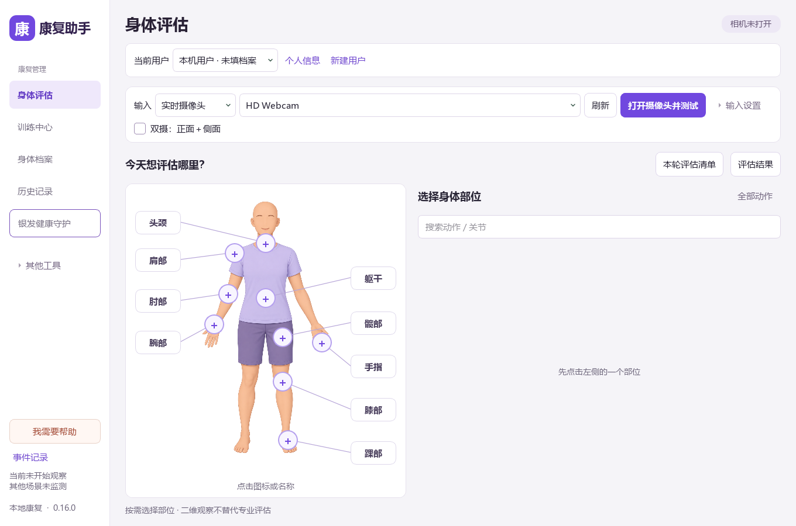

# 居家康复助手

Windows 本地桌面 Demo，用一路普通摄像头或本地录像进行动作观察、评估记录和已确认计划的训练提示。当前 **0.12.0** 包含身体部位导航、53 项任务、个人档案、评估清单、可复用的个人训练计划、训练组次、逐动作时间和按条件核对的纵向历史。

**本机启动：双击 [启动康复助手.cmd](启动康复助手.cmd)。** 第一次从 GitHub 获取源码的电脑，需要先准备运行环境，见下方安装命令。启动不会自动开启摄像头。



## 从哪里开始

1. 打开软件，选择或新建当前用户。
2. 点击“打开摄像头并测试”，检查画面后关闭测试。
3. 在身体评估中点击身体部位和动作；首次可从肩外展开始。
4. 打开正式预览，按该动作提示确认侧别、机位和所需起点，再开始评估。
5. 完成并保存，在身体档案或历史记录查看；需要训练时再人工确认训练计划。

独立相机测试只检查画面，不做动作识别、不保存评估。动作分析采用“先选择动作，再观察对应过程”的方式。腕、踝和手指任务需要单独准备可选关键点环境。

| 阅读入口 | 内容 |
| --- | --- |
| [使用指南](docs/USER_GUIDE.md) | 相机、评估、训练、保存与故障处理 |
| [当前交接与未完成目标](docs/HANDOFF.md) | 同学做到哪一步、哪些还没完成、继续需要什么 |
| [个人训练计划库](docs/history/TRAINING_PLAN_LIBRARY_V0_10.md) | 保存多项训练安排、重开复用、版本与验证 |
| [动作时间记录](docs/history/MOVEMENT_TIMING_V0_11.md) | 出程、峰区停留、回程与连续保持；人工安排和缺测处理 |
| [纵向历史](docs/history/LONGITUDINAL_HISTORY_V0_12.md) | 按原记录条件比较、查看曲线与缺失、导出同一快照 |
| [长期目标续建](docs/plans/PRODUCT_CONTINUATION_2026-09-10.md) | 当前推进顺序和逐阶段验收状态 |
| [本次整理与验收](docs/validation/INTEGRATION_2026-09-10.md) | 压缩包校验、保留的提交历史、本机实际测试 |
| [开发说明](docs/DEVELOPMENT.md) | 环境准备、代码结构、分批回归和提交 |
| [完整文档索引](docs/README.md) | 规格、历史计划、原始实施包和第三方来源 |

## 首次安装

要求 Windows x64 与 Python 3.13。在仓库根目录执行：

```powershell
powershell -NoProfile -ExecutionPolicy Bypass -File .\Setup-Rehab.ps1 -IncludeLandmarks
```

官方下载较慢时，可以明确选择镜像；可选组件的 wheel 仍核对官方 PyPI SHA256：

```powershell
powershell -NoProfile -ExecutionPolicy Bypass -File .\Setup-Rehab.ps1 -IncludeLandmarks -IndexUrl https://pypi.tuna.tsinghua.edu.cn/simple
```

主环境和可选关键点环境分别安装，模型来源与 hash 随代码记录。GitHub 不包含虚拟环境、模型二进制或个人数据库。

## 项目目录

```text
项目根目录/
├─ 启动康复助手.cmd             日常启动
├─ Start-Rehab.ps1              启动脚本
├─ Setup-Rehab.ps1              首次环境准备
├─ README.md / AGENTS.md        总说明与协作约定
├─ docs/                       使用、交接、开发、规格、历史和验收
├─ rehab_codex_single_camera_v2_1/
│  ├─ app/                     应用代码与原生界面
│  ├─ assets/ / configs/        资源、模型清单与规则
│  ├─ scripts/ / tests/         开发工具与自动测试
│  ├─ requirements*.txt        固定依赖与原始参考清单
│  └─ data/ / .venv*/ …        本机数据与环境，Git 忽略
└─ backups/                    原始压缩包和整理前备份，仅本地
```

应用目录保留历史名称以兼容既有环境和数据；当前版本由 `app/__init__.py` 定义。源代码保持一个 Git 仓库，同学的提交历史已连续接入。

## 当前验证范围

这是工程 Demo。软件测试、空白帧模型推理和合成流程能证明相应程序路径工作；真人识别准确度、实际相机长期表现和使用者操作验收仍需独立记录。53 项任务不等于全部关节已完成临床评估。

同一时刻只有一路输入、一个活动场景。实际动作示范素材和双摄联合分析仍未完成；完整待办见[交接清单](docs/HANDOFF.md)。
