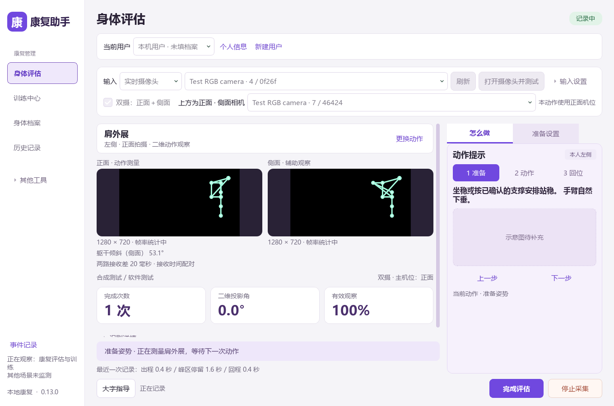

# 正面＋侧面双摄 · 0.13.0

2026-09-10。用户要求实现到货摄像头的双摄接入，随后说明第二设备稍后插上。软件按两路本地 RGB、同一参与者、一个康复任务实现。首次及本轮后续 DSHOW 枚举均仅见 HD Webcam，第二台设备尚未接入；下方软件验收不能替代两台真实相机的测试。

## 使用步骤

1. 双击根目录 `启动康复助手.cmd`，在身体评估或训练中选择实时摄像头。程序启动不会自动采集。
2. 插入两台设备后点“刷新”，勾选“双摄：正面＋侧面”。上方选择正面相机，下方选择侧面相机；使用当前明确的 DSHOW 或 MSMF 接口。角色按设备路径记忆，当前索引变化后重新解析，缺失或重复时不会默认打开其他设备。
3. 点击“打开摄像头并测试”，先检查两路原始画面，然后关闭。测试不加载姿态模型、不计数、不生成评估、不保存图像。
4. 选择动作和本人侧别，打开正式预览。主机位自动采用该动作的正面或侧面要求；另一机位为辅助观察。按原动作步骤设置舒适起点、方向或坐站基线。
5. 人工确认两路都是同一人、主辅机位和测试侧正确，再确认准备并开始。辅助侧面需看到测试侧肩髋；辅助正面需看到双肩，躯干偏斜还需双髋。
6. 结束并保存，可在历史中重开报告。停止采集或隐私暂停均释放两台设备；“暂停训练”仅暂停计次，两幅预览仍开启。



图中是明确标记的合成测试输入，只用于确认软件数据与显示位置，不是摄像头实测或动作示范素材。

## 两路如何参与测量

动作角度、计数、目标和时间仍由所选动作定义对应的主机位计算。主视角可以使用原有 YOLO 或所选动作的可选 MediaPipe 组件；辅助视角使用单独的 YOLO 实例，拥有独立跟踪器和滤波状态。模型权重沿用已有可信清单，不新增下载或依赖。

辅助指标为独立的二维投影：

| 辅助机位 | 指标 | 定义与限制 |
| --- | --- | --- |
| 正面 | 肩线倾角 | 双肩连线与画面水平线的无符号夹角，肩距至少 40 像素 |
| 正面 | 躯干相对骨盆偏斜 | 肩髋中线相对骨盆连线法线的二维偏斜，沿用已有整体躯干参考线门槛 |
| 侧面 | 躯干倾斜 | 测试侧髋至肩连线与画面竖线的无符号夹角，连线至少 50 像素，未扣除机位倾斜 |

像素门槛是工程几何门禁，不是医学阈值。辅助指标逐项保留有效性和原因，没有自动目标或临床评分；不能解释为肌力、真实负重或康复改善。辅助缺点也不会填入主画面的公式，主指标缺失仍按原规则拒测。

帧按单调接收时间近邻配对，每帧只用一次，允许接收差上限 0.12 秒。每路最多保留 4 张已进入配对器的画面，未匹配和过期帧丢弃。这个时间来自各采集进程读到帧后，不是相机曝光时间；未实现硬件同步、空间标定或三维重建。

## 失效与保存

- 只有 CameraManager 拥有两路 SourceWorker。两个保存的设备引用都成功解析后才启动；打开或上下文切换失败时释放两路，未确认退出时继续锁定新采集。
- 两路都需要有当前配对。辅助姿态不可用时主观察标记缺测，暂停有效计数与连续保持；已完成次数保留。任一路多人或跟踪归属变化独立触发中断，辅助缺点不能覆盖主路的多人警告。
- 任一路输入错误、新配对超时或正式任务中的推理失败，结束整个双摄任务；不自动回落成单摄。新上下文重置两路跟踪、过滤和配对缓存，丢弃旧回调。默认已接通输入超过 3 秒无新配对即超时，启动等待使用原有独立门槛。
- 记录包含 `capture_mode`、`dual_camera` 快照、逐路设备 / 模型 / 定义 / 实际图幅与帧率、每对时间和序号、辅助值及质量。故障来源能定位时记录机位；配对器计数与经过姿态推理的观察数分开，均不冒充总曝光数。
- 普通 HTML / JSON / CSV 导出匿名化设备路径和来源引用，双摄另生成 `dual-camera.csv`。默认不保存图像或骨架；明确同意保存本次骨架时保留两路独立来源的姿态。保存失败仍保留待保存快照并阻止新任务。
- SQLite 结构不变，不改写旧报告。纵向比较版本更新为 `recorded-conditions-2`，加入单双摄、主机位、两路来源 / 模型 / 尺寸 / 请求参数和配对定义；缺少应有双摄字段的记录不能回落为单摄或视为同条件。

## 软件验收

最终完整回归覆盖 62 个测试文件、11 个互不重复的批次：**1317 项主测试、4 项子测试全部通过，0 失败、0 错误、0 跳过**。业务 728 项、界面 368 项、集成 221 项；子测试另列。结果见[本轮测试汇总](../validation/results/2026-09-10-dual-camera-v013.json)。保留首次检查失败记录：旧布局测试读取隐藏按钮的旧位置，进一步确认实际可见按钮正常后，改为逐个切换到该按钮实际显示的生命周期状态再核对，未放宽按钮大小或窗口边界要求。

实际执行的验证包括：

- 配对与去重、设备缺失 / 重名 / 索引变化、同一设备拒绝、第二路启动和释放失败回滚、两路上下文隔离。
- 合成轨迹计数、辅助缺点和双方人员变化、尺寸变化、两路骨架授权、保存失败恢复、导出匿名化及纵向条件差异。
- 实际 Runtime 线程与临时 SQLite，注入两个软件采集器，验证任一路错误 / 超时、关闭重开、正式任务中断与隐私释放；这不是 USB 实机测试。
- 两个真实本地 YOLO 模型对空白合成帧推理，验证两个 predictor / ByteTrack 对象互相独立，切换上下文后同时重置；空白图不能证明真人检测或角度精度。
- 7 张原生截图逐张检查：设备选择、1100×730 与 1360×900 双画面、原始测试、大字指导、辅助缺点和双摄报告。通过临时数据库关闭重开与导出检查。QA 证据见[界面检查摘要](../validation/results/2026-09-10-dual-camera-ui.json)。

另以独立数据目录启动 0.13.0 并检查首页，启动没有开启相机；Python 编译检查和 119 个相对文档链接检查通过。本机原有用户数据库与本轮开发前备份的 SHA256 一致，未混入测试记录。

## 实机检查入口与未完成项

[本轮枚举记录](../validation/results/2026-09-10-dual-camera-enumeration.json)仅有 HD Webcam，未打开相机。待第二设备插入后，可使用应用的原始画面测试；也可在应用目录执行：

```powershell
.\.venv\Scripts\python.exe scripts\check_dual_camera.py --list --backend dshow --output .runtime\pair-list
```

按当次输出的 `current_index` 填写两个参数，不能直接复用旧索引或把下拉框行号当设备索引：

```powershell
# 将 0 和 1 替换为当次明确选择的两个设备索引；下方只是命令格式示例。
.\.venv\Scripts\python.exe scripts\check_dual_camera.py --backend dshow --frontal-index 0 --sagittal-index 1 --seconds 5 --runs 2 --output .runtime\pair-capture
```

工具分别重新解析路径，打开两路，采样 5 秒后释放，再重开检查；每次输出目录必须是新的。只保存状态、实际图幅 / 接收帧率 / 配对时间差等数字，不加载模型、不写图像、不访问用户数据库。报告明确区分尝试打开和实际观察到帧。指定机位角色不代表脚本验证了物理摆放角度。

两路真实同时采集、驱动 / USB 带宽、断线重连、长时间运行、现场机位和真人动作准确度仍待实测。当前软件实现不声称这些项目已通过；后续真人验收仍按[已建立的样本与人工对照入口](../validation/ACCEPTANCE_READINESS_2026-09-10.md)记录。
