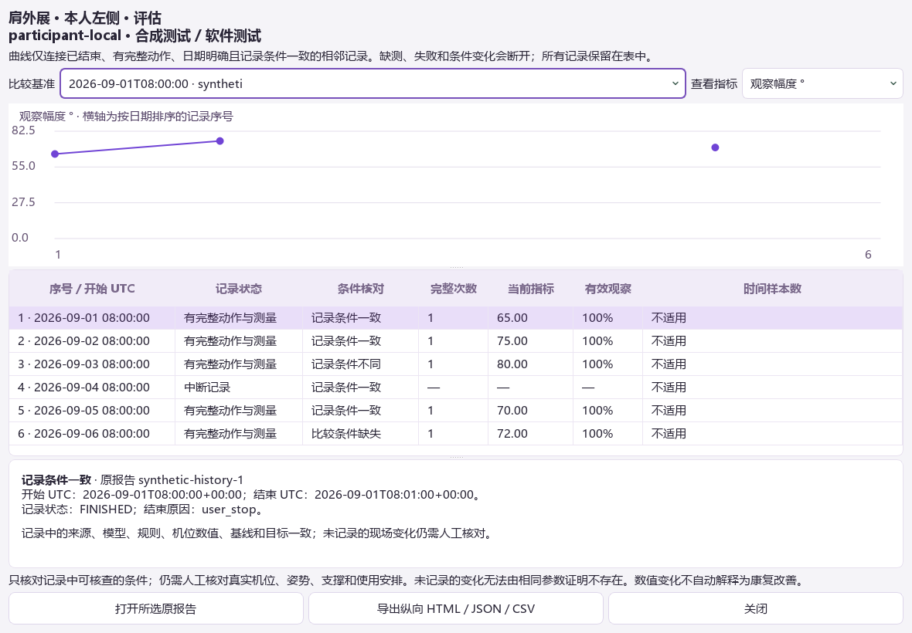

# 0.12.0：按记录条件核对的纵向历史

在历史页选中一份康复报告，点击“纵向记录”。同一用户、来源、情境、动作、本人侧别和评估 / 训练模式的记录按明确的 UTC 日期排列，缺失日期的记录放在末尾。更换基准、选择数值、查看条件差异和打开原报告都不改写已有数据。

## 比较契约

`recorded-conditions-1` 从原始保存快照派生条件。必须核对来源引用、机位标识、拍摄方向、放置版本、实际尺寸、原图区域、相机接口和请求参数（实时来源）、模型清单、骨架 / 坐标 / 关节点顺序、组件、规则、预处理与输入时钟、动作测量定义、实际校准数值、人工目标和分期参数、时间算法版本。

原来使用的整个 `plan_hash` 和 `profile_version` 还包含评估引用、名称、确认时间、校准记录时间和跟踪 epoch。因此本次排除这些非测量元数据，直接核对它们所包装的实际条件。仍要求数值基线精确相等，没有引入未经验证的容差；关节基线的角度或方向、坐站的膝角 / 髋高、人工目标和阈值发生变化都会分开。比较状态为“记录条件一致 / 不同 / 缺失”，两边都没有某条件不等于相同。

相同参数不能证明真实机位没有移动，也不能识别未记录的支撑、姿势或用药变化。界面与导出明确提示人工核对，不将数值变化解释为康复改善。

## 数值与曲线

保留每条记录的完成次数、投影角范围 / 最大值、有效观察比例、结束状态和原因。旧角度兼容读取沿用原身体档案的规则，并保存其来自会话汇总还是本记录有效样本；不取其他会话的数据补空。

时间指标取本记录中完整动作的有效时间中位数，分别显示有效数值数 / 完整动作数。仅 `observed-timing-1` 数据进入时间统计，不从旧总时长推算。中位数不是跨日期平均值，也不是临床常模。

曲线只连相邻且记录条件一致、已结束、有明确开始 / 结束日期、至少一次完整动作及有效角度的记录；所选指标缺失时断开。不同条件、失败、无完整动作和日期不足的表行全部保留，孤立有效点单独显示。横轴是排序后的记录序号，不按日历间隔缩放；完整日期可在表列、工具提示及详情查看。

## 保存和导出

此功能是只读视图，无数据库升级。曲线、表行与条件来自同一份快照；导出前在工作线程重新读取并核对完整指纹，若报告被删除或数据变化，要求刷新后导出。不存在的基准不会自动换成其他记录。

导出含 `history.html`、`history.json`、`history.csv` 和所选指标的 `chart.svg`。保留原记录引用、各项数值、样本数及条件差异；按既有规则匿名化用户标识和来源路径。JSON 的 `source_fingerprint` 对应屏幕上已核对的原快照，`export_content_sha256` 对应去除该校验字段后的导出内容。非空目录不覆盖。

## 实际验证

完整固定回归 **1233 项主测试和 4 项子测试通过，0 失败 / 错误 / 跳过**：核心 659、界面 359、集成 215，共 52 个文件、9 批。修正小窗口列宽后的 5 项纵向 UI 测试另外复查通过，不重复计入总数。见[原始摘要及 QA 证据](../validation/results/2026-09-10-history-v012.json)。

新增 46 项覆盖各隔离维度、模型 / 规则 / 目标差异、双方缺失、数值基线与非测量时间区分、失败 / 未知日期保留、图线断开、时间中位数分母、空值、旧记录、基准删除、迟到响应、导出指纹与匿名化、真实 Runtime / 临时 SQLite 读写及重开。

`scripts/qa_longitudinal.py` 使用合成关节点经过原动作引擎产生记录，并人工构造日期与失败 / 条件变化案例。1180×820 和 880×650 的原生窗口、差异详情、时间指标及导出 SVG 已目视检查；没有打开摄像头或使用真人历史。这些日期和变化仅用于软件验收，不是用户数日的真实康复结果。

