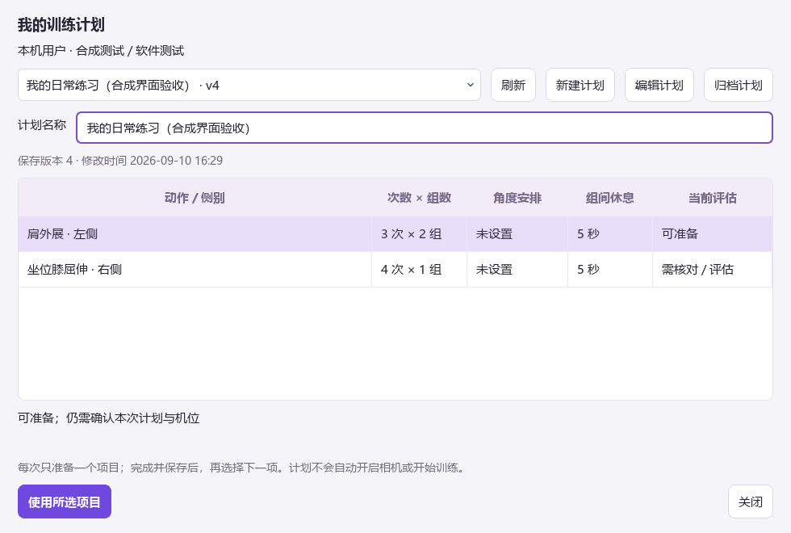

# 0.10.0：可复用的个人训练计划

用户要求继续推进长期目标后的第一阶段。先前训练设置只属于当前准备，关闭后无法作为个人计划重开；现在可以在“训练中心 → 我的训练计划”保存多项安排，之后逐项使用。

## 行为与数据

- 一份计划有名称、多个动作 / 本人侧别及各自的次数、组数、休息、可选角度和已有提醒设置。项目可编辑、重排、移除；计划可归档和恢复。
- 计划按用户、输入来源和使用情境隔离。只保存人工安排，不根据评估结果产生目标；未填写目标保持为空。
- 使用项目时读取当前有效评估并检查测量定义；最近失败不借用旧成功。开始前仍需本次计划确认、有效预览、必要起点 / 坐站基线与机位确认。
- 计划本身不保存可复用的相机确认、基线、旧帧或输入句柄。每项训练独立结束和保存，然后由用户选择下一项。
- 保存、归档和恢复均带版本检查。并发修改会报错并保留草稿；已加载但尚未开始的旧版计划会要求重新选择。
- 会话保存 `saved_plan_reference`，包括来源版本与项目快照。如果只修改本次训练设置，报告明确列出与保存计划的差异；修改 / 归档计划不改写旧报告。普通导出保留可追溯 ID 与数值，去除计划自由名称。
- SQLite 从 v1–v3 升级到 v4 前建立 `.before-v4-*.bak`，只增补表和索引；旧会话不重写。只读旧库返回空计划列表，不通过读取迁移。

## 验证

在应用目录执行 `scripts/check_project.py --output .runtime/checks/product-plan-v010`，46 个文件、9 个独立批次全部通过：**1158 项主测试、4 项子测试，0 失败 / 错误 / 跳过**。[逐批结果](../validation/results/2026-09-10-plan-v010.json)保留原 pytest 摘要，原始日志和 JUnit 留在本地。

新增回归覆盖计划白名单、非法数值、缺失安排不自动补值、来源隔离、最后失败评估、测量定义变化、版本冲突、归档恢复、备份迁移、只读旧库、开始时重查、不可变快照、报告转义和普通导出去名。原有业务、UI、YOLO / MediaPipe 实际 SDK 和合成回放也通过完整回归。

`scripts/qa_plan_library.py` 通过真实 Runtime 和临时 SQLite，从原生按钮完成新建多项目、编辑、保存、归档、恢复、关闭重开、选择项目和本次计划确认。780×540 和 980×660 计划窗口，以及训练准备页已经截图并目视检查；Python 编译检查通过。

QA 使用明确的合成评估和独立临时数据库，没有打开摄像头或改写当前电脑的个人历史。软件验收不证明真人测角、计数或训练适用性。

## 后续

按[续建计划](../plans/PRODUCT_CONTINUATION_2026-09-10.md)继续逐动作节奏 / 保持记录及条件可比的历史。真人准确度、动作素材与双摄等依赖仍在[交接清单](../HANDOFF.md)中单列。
